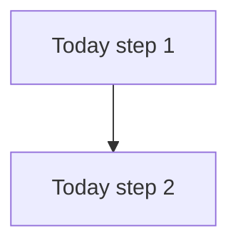
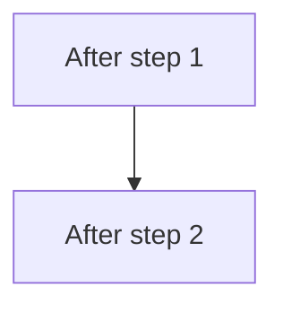

# Technical Approach Document (TAD)

Generate a technical approach document for a project or initiative. Walk through discovery, codebase research, and collaborative solution design — then produce a reviewable markdown file.

`$ARGUMENTS` is optional context: a brief description of the project, a ticket ID, or a document URL.

---

## Phase 0 — Choose output destination

Before gathering any context, ask the user:

> "Where should the final tech approach live? Reply with:
>
> - **`markdown`** — I'll write a new file under `docs/tech-approaches/<slug>.md`.
> - **`document`** — paste the URL of an existing document in your connected tracker or docs tool and I'll update it. I won't create one from scratch."

Wait for an answer before proceeding. Record the choice:

- **markdown** — target path is `docs/tech-approaches/<slug>.md`.
- **document** — the user must paste a document URL. If they don't, ask again; do not create a new document. Resolve the document from the URL and confirm it exists using the connected MCP's document-fetch tool before continuing.

Carry this decision through to Phase 4.

---

## Phase 1 — Gather context

### 1.1 Ask for reference documents

Before doing anything else, ask the user:

> "Do you have any documents, tickets, or other references I should read before we start? Paste URLs or IDs and I'll pull them in."

If the user provides:

- **Document URLs** — fetch each via the connected docs MCP (Notion, Confluence, or similar).
- **Ticket IDs** (e.g., `ABC-1234`) — fetch each via the connected tracker MCP. Pull description, acceptance criteria, comments.
- **Nothing** — proceed with `$ARGUMENTS` and the conversation.

A PRD is the typical anchor. Assume the reader has read it — the TAD should not re-explain product motivation in detail.

### 1.2 Summarize what you know

Present a tight summary:

- **Goal**: 1–2 sentences
- **Constraints**: deadlines, dependencies
- **Open questions**: anything unclear

Ask the user to confirm before moving on.

---

## Phase 2 — Codebase research

Search the codebase to find:

- Existing patterns relevant to the feature (models, services, components, routes, mutations).
- The files this work will touch.
- Whether an analogous pattern exists or whether anything is novel.

Share a brief summary. Only reference files and patterns you actually found.

---

## Phase 3 — Collaborative design

### 3.1 Ask for the user's intuition

> "Do you already have ideas about how this should be tackled? Any preferences on approach, patterns to follow, or things to avoid?"

### 3.2 Ask before applying any new pattern

If the work introduces a pattern that does not exist in the codebase yet (new abstraction, new dependency, new infra), pause and check with the user. Cheap to ask, expensive to design around the wrong shape.

### 3.3 Iterate on the approach

Propose an approach as a conversation, not a finished document:

- The zoom-out: overall direction and what changes per scope to hit the goal.
- The trade-offs and the choices behind them.
- The biggest risks.

Iterate until the user is satisfied. The conversation IS the design process.

---

## Phase 4 — Produce the document

### 4.1 Write the document

Use the destination chosen in Phase 0:

- **markdown** — write to `docs/tech-approaches/<slug>.md` where `<slug>` is a kebab-case name derived from the project title. Use the Write tool.
- **document** — update the document the user provided via the connected MCP's document-save tool. Do not create a new document. Preserve the existing title unless the user asks otherwise; replace the body with the rendered content below.

The structure below is a starting point. Reshape headings, drop sections, or add new ones to fit the project — the goal is a document a human can read end-to-end without losing interest.

```markdown
# <Project Title> — Technical Approach

PRD: <link>
Figma / design: <link if relevant>

## Goal

<1–2 sentences. What is changing and why. Defer product motivation to the PRD.>

## Open questions

<Only genuinely unresolved items. Questions resolved during design belong inline in the relevant task, or are removed.>

## Assumptions

<Short list of decisions taken as given. Skip anything already obvious from the PRD or the codebase. Include the feature flag name here unless the user has opted out of one.>

## Approach

<The zoom-out. What is the overall direction, and what changes per layer or scope to hit the goal? A few paragraphs at most. Leave room for the reader to reason about details — do not pre-empt every question.>

## Scope

In:

- <what's included>

Out:

- <what's explicitly not included>

## Flow (optional)

<Include when behavior changes are non-trivial — e.g., new branches, new background processes, new state transitions. Skip when the change is purely structural or visual. Use Mermaid flowcharts, one for "Today" and one for "After", and keep them high-level. End with a one-liner naming the new branches so the reader knows where to look.>


```



## Proposed tasks

<Break the work into pickup-ready chunks. Each task is one coherent deliverable that an engineer or LLM can run with after reading just its section. Order them, then call out sequencing at the end.>

### 1. <Task title>

<A few sentences on what the task delivers and the idea behind the implementation. Code snippets are welcome as ideas — they will change at implementation time, so do not annotate them. The code should speak.>

### 2. <Task title>

...

### Sequencing

<Which tasks can start in parallel, which depend on which.>

## Test plan

<High-level. Tests are implicit per task; do not list specs.>

- How we know it works: <a few user-visible behaviors that show the feature is healthy>
- How we know if it's broken: <signals — dashboards, alerts, queries, etc.>

## Rollout

<Short. Flag name, phased plan, when to remove the flag.>

```

### 4.2 Confirm with the user

Confirm using the destination chosen in Phase 0:

- **markdown** — "Tech approach document written to `docs/tech-approaches/<slug>.md`. Want to review it, or should we iterate on any section?"
- **document** — "Tech approach written to the document at `<url>`. Want to review it, or should we iterate on any section?"

---

## Phase 5 — Iterations

If the user requests changes:

1. Read the existing content first:
   - **markdown** — read the file with the Read tool.
   - **document** — fetch the current body via the connected MCP's document-fetch tool.
2. Apply changes:
   - **markdown** — use the Edit tool for targeted changes.
   - **document** — save the updated body via the connected MCP's document-save tool. Apply targeted changes to the existing content; do not rewrite the whole document unless asked.
3. Summarize what changed.

Targeted edits, not rewrites.

---

## Guidelines

- **Keep it concise and human-readable.** A reviewer should be able to read the whole document without losing interest. The PRD covers product motivation; the TAD covers the technical approach.
- **Open questions and assumptions go near the top.** Right after the Goal. The reader should see what is uncertain and what is taken as given before reading the approach.
- **Zoom out first.** Lead with overall direction and what changes per scope. Details belong inside the proposed tasks, not the overview.
- **Ask before applying new patterns.** If something does not already exist in the codebase, surface it to the user instead of designing around an assumption.
- **Split 5-point tasks when possible.** A task estimated at 5 is a yellow flag — try to break it into a 2 + 3 or similar. Some tasks are genuinely one coherent unit; in that case keep them at 5 and say so.
- **Default to a feature flag.** Plan for a new flag on any new feature unless the user opts out. Note the flag name in Assumptions and the removal step in Rollout.
- **Add a flow diagram when behavior changes.** Two small Mermaid flowcharts (Today / After) beat a paragraph for any change with new branches or new background processes. Skip the section when the change is purely structural or visual.
- **Code blocks are ideas, not specs.** Snippets convey the shape of an idea and will change at implementation time. Do not annotate them line-by-line; the code should be readable on its own.
- **Leave room for reasoning.** Not every question needs an answer up front. Some points should let the reader (or implementer) think rather than be pre-empted.
- **Test plan is high-level.** Tests are implicit per task. Describe how to know the feature works and how to know if it is not.
- **Headings are advisory.** Reshape the structure to fit the project; the template is a starting point, not a contract.
- **No emojis.** Anywhere — headings, body, captions.
- **Ground everything in the codebase.** Never fabricate file paths or patterns. Only reference what you actually found via search.
